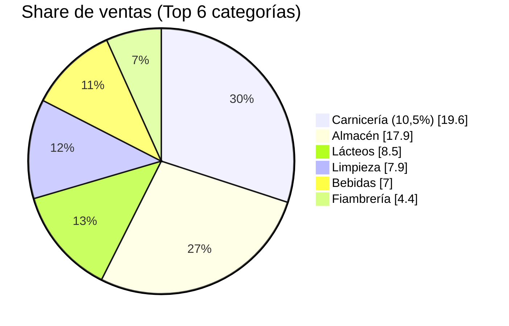
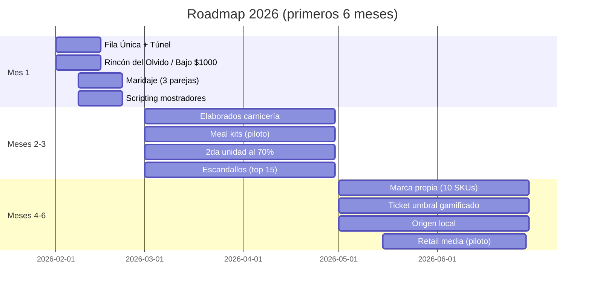

# PLAN ESTRATÉGICO 2026: PROYECTO “EVOLUCIÓN DON NINO” (VERSIÓN CODEX)
**Para:** Directorio / Gerencia General  
**Fecha:** Enero 2026  
**Objetivo 2026:** Maximización de Densidad de Ticket (UPT), Blindaje de Margen y Excelencia Operativa.  
**Base analítica:** Oct 2024 – Dic 2025 (345.130 tickets) + repositorio de análisis (Pareto, tribus, reglas de canasta, KPI por categoría).  

---

## 0) Decisiones solicitadas al Directorio (15 minutos)
1. **Aprobar la implementación de Fila Única + “Túnel de Tentación”** (reconfiguración física de cajas + exhibidores).  
2. **Aprobar la política comercial 2026** (promos, surtido, marca propia táctica) y el esquema de gobernanza (Comité Comercial).  
3. **Aprobar presupuesto inicial** de ejecución (señalética, exhibidores, packaging, capacitación, materiales de control).  
4. **Aprobar metas 90/180/365 días** y responsables por iniciativa (control semanal).  

---

## 1) Resumen Ejecutivo
Supermercados Don Nino entra a 2026 con un contexto de **consumo contraído** y competencia agresiva de formatos “Express”. La evidencia del repositorio muestra una base de negocio sólida, pero con una oportunidad clara: **aumentar ítems por ticket (UPT) y capturar margen**, dejando de operar solo por volumen.

### Línea base (KPIs)
| KPI | Valor |
|---|---|
| Tickets analizados | 345.130 |
| Ticket promedio ($) | 27.671 |
| Unidades por ticket (UPT) | 10,10 |
| Productos únicos por ticket | 7,94 |
| Margen bruto estimado (%) | 28,23% |

### Distribución de ticket (para diseñar umbrales y packs)
| Percentil | Ticket ($) |
|---|---|
| P25 | 7.141 |
| P50 | 15.824 |
| P75 | 32.963 |
| P90 | 61.472 |
| P95 | 88.316 |

### Notas de calidad de datos (para medir bien)
- El dataset incluye **anulaciones/devoluciones** (tickets negativos y outliers). Para KPIs operativos, tomar como base **tickets con ventas > 0**.
- **Datos horarios:** en el dataset actual no son confiables para gestión fina (picos por hora). Se propone instrumentar: muestreo manual 2 semanas + ajuste de captura en POS si es posible.
- Definir “**semana 0**” (baseline) antes de cada cambio importante (fila única, promo fuerte, lanzamiento marca propia).

### Tesis del plan
Cambiar el paradigma: **de “despachar mercadería” a “gestionar experiencia + margen”**.  
Este documento consolida **20 propuestas comerciales** (volumen y margen) y profundiza una **propuesta estructural** (Fila Única) como palanca de ventas de impulso, seguridad y mejora de percepción.

---

## 2) Diagnóstico: oportunidad latente (con evidencia)

### 2.1 Tráfico vs. Margen
- **Carnicería** concentra la facturación: `CARNICERIA AL 10,5 %` representa **19,6%** de las ventas totales.
- **Panadería / elaboración propia** es “motor de tickets”: categorías de panificados aparecen en **≈51% de los tickets** (oportunidad natural de cross-sell).
- **Golosinas** (impulso) hoy tienen baja participación de ventas (≈1,5%), pero alta rentabilidad: margen mensual promedio estimado **≈$3,86M**.

Top categorías por ventas (share y margen estimado):
| Categoría | Share ventas | Margen% est. | Ventas (M$) |
|---|---:|---:|---:|
| CARNICERIA AL 10,5 % | 19,6% | 20,0% | 1.876,4 |
| ALMACEN | 17,9% | 28,0% | 1.713,4 |
| LACTEOS | 8,5% | 30,0% | 809,7 |
| LIMPIEZA | 7,9% | 28,0% | 750,0 |
| BEBIDAS | 7,0% | 25,0% | 667,5 |
| FIAMBRERIA | 4,4% | 45,0% | 424,1 |



> Nota de lectura: los márgenes por categoría son “estimados” en base a factores actuales del dataset; el plan incorpora acciones para pasar a **costos reales/escandallos**.

### 2.2 Potencial de impulso y venta cruzada (reglas de canasta)
Existen asociaciones extremadamente fuertes (lift) que hoy no están “explotadas” con layout y señalética.

Top combos detectados (para activación inmediata):
| Antecedente | Consecuente | Lift | Soporte | Confianza |
|---|---|---:|---:|---:|
| FERNET BRANCA X 750 CC | COCA COLA PET X2.5LT | 28,3x | 1,02% | 76,4% |
| COSTILLA ARQUEADA + CHORIZO PURO CERDO | MORCILLA VALENCIANA | 15,4x | 0,77% | 62,3% |
| ILOLAY QUESO BARRA | PALADINI JAMON COCIDO | 5,3x | 1,62% | 35,9% |

### 2.3 Fuga de eficiencia (surtido + capital de trabajo)
El Pareto es contundente:
- **14,2% de SKUs explican ~80% de la venta** (1.289 SKUs de 9.058).  
- El **50% de SKUs de menor venta** explica apenas **~3%** de la facturación.

Esto habilita una política 2026 de **racionalización de surtido** para liberar capital, mejorar rotación y foco operativo.

### 2.4 Segmentación de tickets (“Tribus”)
Sin ID de cliente, el repositorio segmenta por comportamiento de ticket. Dos tribus dominan:
| Tribu | % tickets | Ticket medio ($) | UPT medio | Implicancia |
|---|---:|---:|---:|---|
| Compra Rápida/Conveniencia | 87,6% | 17.974 | 6,6 | principal foco de aumento de UPT (sumar 2–4 ítems) |
| Reposición Regular | 12,4% | 94.642 | 34,5 | foco de bundles/meal kits y protección de margen |

---

## 3) Objetivos 2026 (metas cuantificadas + métricas de control)
Metas propuestas (ajustables con Directorio; “a medir” indica que requiere instrumentación operativa):

| Objetivo | Línea base | Meta 90 días | Meta 180 días |
|---|---:|---:|---:|
| Densidad (UPT) | 10,10 | 10,6 | 10,9 |
| Penetración GOLOSINAS (% tickets con al menos 1) | 14,24% | 16,5% | 18,0% |
| Unidades BEBIDAS por ticket (en tickets con bebidas) | 2,96 | 3,10 | 3,25 |
| % tickets con ≥4 unidades de BEBIDAS | 8,04% | 9,0% | 10,0% |
| Mix elaborados carnicería (ventas elaborados / ventas carnicería total) | ~9% | 12% | 15% |
| Merma panadería/rotisería (a medir) | a medir | -10% | -20% |
| SKUs “C” (cola larga) | 5.377 | -5% | -10% |
| Tiempo de espera en cajas (a medir) | a medir | -15% | -30% |

---

## 4) El núcleo estratégico: 20 propuestas de valor + la propuesta estructural
Estructura: **Eje A (Volumen)**, **Eje B (Margen)** y **Eje C (Fila Única)**. Cada iniciativa incluye ejecución y KPI mínimo.

### Matriz de priorización (visión Directorio)
| # | Iniciativa | Eje | Impacto | Esfuerzo | Horizonte |
|---:|---|---|---|---|---|
| 1 | Maridaje en góndola (cross‑merch) | A | Alto | Bajo | 2–4 semanas |
| 2 | Packs “Solución de Cena” | A | Medio/Alto | Medio | 4–8 semanas |
| 3 | 2da unidad al 70% | A | Medio | Bajo | 2–4 semanas |
| 4 | Venta sugestiva (scripting) | A | Medio | Bajo | 2–3 semanas |
| 5 | “Rincón del Olvido” | A | Medio | Bajo | 1–2 semanas |
| 6 | Degustación cruzada | A | Medio | Medio | 4–6 semanas |
| 7 | Ticket umbral gamificado | A | Medio/Alto | Medio | 4–8 semanas |
| 8 | Multipacks de bebidas | A | Medio | Medio | 4–8 semanas |
| 9 | Sección “Bajo $1000” | A | Medio | Bajo | 1–2 semanas |
| 10 | Retail Media / alquiler de cabeceras | A | Medio | Medio | 6–10 semanas |
| 11 | Carnicería: “Listos para cocinar” | B | Alto | Medio | 6–12 semanas |
| 12 | Auditoría de recetas (escandallos) | B | Alto | Medio/Alto | 6–12 semanas |
| 13 | Marca propia táctica | B | Alto | Medio | 8–16 semanas |
| 14 | Precio ancla (decoy) en vinos | B | Medio | Bajo | 2–4 semanas |
| 15 | Venta fraccionada de lujos | B | Medio | Bajo/Medio | 4–6 semanas |
| 16 | Happy Hour panadería | B | Medio | Bajo | 2–4 semanas |
| 17 | Monetización de cola larga (bazar) | B | Medio | Medio | 6–10 semanas |
| 18 | Origen local (premium emocional) | B | Medio | Medio | 6–10 semanas |
| 19 | Racionalización surtido | B | Alto | Medio/Alto | 8–16 semanas |
| 20 | Venta de servicios | B | Bajo/Medio | Bajo | 6–10 semanas |
| 21 | Fila Única + Túnel de Tentación | C | Alto | Medio | 2–4 semanas |

---

## EJE A — Aumento de volumen (cross‑selling + ticket promedio)
*Objetivo: que el cliente que viene por el pan o “compra rápida” se lleve 2–4 ítems adicionales.*

### 1) Maridaje en Góndola (Cross‑Merchandising)
**Qué es:** romper la lógica “por pasillo” y armar micro‑misiones de compra (asado, picada, fernet, desayuno).  
**Dato clave:** existen lifts de 5x a 28x en productos complementarios (ver combos).  

**Ejecución (checklist 10 días):**
1. Seleccionar 8 “parejas” de alto lift.
2. Reubicar (o duplicar facing) en 1 punto por pareja (cabecera/isla).
3. Señalética simple: “Si llevás X, te conviene sumar Y”.
4. Medir penetración conjunta semanal.

**Ejemplos (del dataset Don Nino):**
| Pareja/Combo | Evidencia |
|---|---|
| FERNET BRANCA X 750 CC + COCA COLA PET X2.5LT | Lift 28,3x |
| COSTILLA ARQUEADA + CHORIZO PURO CERDO + MORCILLA VALENCIANA | Lift 15,4x (triple asado) |
| PALADINI JAMON COCIDO + ILOLAY QUESO BARRA | Lift 5,3x |

**KPI mínimo:** % tickets con pareja/triada y margen incremental por semana.

---

### 2) Packs “Solución de Cena” (Meal Kits)
**Qué es:** agrupar físicamente ingredientes para resolver una ocasión (cena rápida) con precio único y receta.  
**Por qué funciona:** reduce fricción (“no pienso, agarro”) y sube UPT sin competir solo por precio.

**3 kits piloto (30 días):**
| Kit | Componentes (ejemplos) | Objetivo |
|---|---|---|
| Pasta Express | FIDEOS PASTA REGGIA + ARCOR PURE DE TOMATE 520g + QUESO RALLADO | Subir UPT en compras rápidas |
| Milanesa + Puré | MILANESAS DE POLLO NINO + MAGGI PURE DE PAPAS + ACEITE | Migrar “compra rápida” a “cena” |
| Picada Mendocina | SALAME MILAN LARIO + PALADINI MORTADELA + QUESO (barra/cremoso) | Aumentar ticket con productos de margen |

**KPI mínimo:** tickets con kit / semana y UPT promedio de esos tickets.

---

### 3) Estrategia “2da Unidad al 70%”
**Objetivo:** aumentar unidades por compra en reposición (stock‑up) **sin destruir margen/caja** como suele ocurrir con 2x1 masivo.  
**Qué es:** reemplazar 2x1 por un mecanismo que incentiva volumen pero mantiene ingreso en la 1ra unidad y controla la pérdida en la 2da.  

**Dónde aplicarlo (criterio):**
- Alta rotación y stock‑up (limpieza, bebidas, almacén básico).
- Productos con elasticidad alta y margen defendible.

**Selección inicial sugerida (ejemplos con datos de tickets y precio):**
| SKU candidato | Categoría | Tickets | Precio med ($) | Uso típico |
|---|---:|---:|---:|---|
| ARGENTINO JABON PANX200GR | LIMPIEZA | 4.607 | 520 | Reposición semanal |
| VIRULANA ESPONJA LISA | LIMPIEZA | 3.669 | 500 | Reposición semanal |
| SODA TALCA X 2250 CC | BEBIDAS | 4.917 | 645 | Stock‑up hogar |
| COCA COLA PET X2.5LT | BEBIDAS | 6.031 | 3.990 | Stock‑up evento/hogar |
| SALCHICHAS PANCHIN X6 UND | FIAMBRERIA | 6.111 | 825 | Complemento / reposición |
| ARCOR PURE DE TOMATE X 520 GR | ALMACEN | 7.833 | 785 | Base de cocina |

**Implementación:**
1. Elegir 10 SKUs (rotación + margen).
2. Señalética en góndola y en caja.
3. Control de quiebres (si falta, la promo destruye confianza).

**KPIs (mínimos):**
| KPI | Línea base | Meta 90 días |
|---|---:|---:|
| Unidades por ticket (SKUs promo) | Semana 0 | +10% |
| Margen neto del set promo | Semana 0 | ≥0 (no negativo) |
| Quiebres en SKUs promo | Semana 0 | -30% |

---

### 4) Venta Sugestiva (Scripting en mostradores)
**Qué es:** protocolo obligatorio de cierre en carnicería/panadería/fiambrería (no “preguntar por preguntar”, sino ofertar complemento con sentido).  

**Ejemplo de scripts:**
| Mostrador | Script de cierre | Upsell sugerido |
|---|---|---|
| Carnicería | “¿Le agrego chorizo/morcilla para completar el asado?” | CHORIZO PURO CERDO / MORCILLA VALENCIANA |
| Fiambrería | “¿Lo acompañamos con queso en oferta?” | ILOLAY QUESO BARRA / cremosos |
| Panadería | “¿Sumamos tortitas o facturas para la merienda?” | TORTAS X 6U. / facturas |

**KPI mínimo:** % tickets con upsell por mostrador (medir por SKU objetivo).

---

### 5) El “Rincón del Olvido” (salida)
**Qué es:** exhibidor vertical a la salida con productos “olvidables” de alta recurrencia y bajo esfuerzo mental.  

**Selección basada en datos (tickets y precio):**
| Producto | Tickets | Precio med ($) | Nota |
|---|---:|---:|---|
| BOLSAS PLASTICAS NINO | 16.494 | 100 | Top frecuencia; compra por necesidad |
| FOSFOROS RODEO X 220 UNID. | 2.705 | 520 | Ideal para asado / hogar |
| DURACELL PILAS AAA X 2 UNI TIRA | 513 | 2.950 | Alto margen, alta necesidad |
| HIELO | 206 | 3.300 | Ocasión “evento” |

**KPI mínimo:** ventas semanales del exhibidor (antes vs después) + % tickets con al menos 1 ítem del rincón.

---

### 6) Degustación Cruzada “In Situ”
**Qué es:** degustación cruzada (viernes/sábado) para empujar productos de margen sobre un “vehículo” de alto tráfico (panadería).  
**Dato clave:** panificados aparecen en ~51% de tickets; fiambrería tiene margen estimado alto.

**Ejemplo de activación:**
- Degustar fiambres/quesos sobre `PAN NINO FLAUTA` o `PAN NINO MIÑON`.
- Señalética: “Probá + llevate la picada armada”.

**Diseño mínimo (2 horas / 2 días por semana):**
| Elemento | Definición |
|---|---|
| Días | Viernes y sábado |
| “Vehículo” de degustación | Panadería (pan flauta/miñón) |
| Producto objetivo | Fiambres/quesos (mix medio y premium) |
| Oferta | “Pack picada” (combo) o % off en 2da unidad |

**KPIs (mínimos):**
| KPI | Línea base | Meta 60 días |
|---|---:|---:|
| Ventas del SKU degustado | Semana 0 | +15% |
| Penetración del combo (tickets con ambos) | Semana 0 | +0,3 pp |

---

### 7) Ticket Umbral Gamificado
**Qué es:** incentivo no monetario (o semi‑monetario) para superar un umbral de ticket y recuperar “llenado de changuito”.  
**Dato clave:** el umbral debe atacar el tramo “movible”. Hoy, **11,4%** de tickets está entre **$30.000–$45.000** y **16,5%** supera **$45.000**.

| Tramo | % tickets (ventas > 0) | Lectura |
|---|---:|---|
| $30k–$45k | 11,4% | Tramo “convertible” al umbral |
| ≥$45k | 16,5% | Base actual del objetivo |

**Diseño sugerido:**
- Umbral inicial: **$45.000**.
- Premio: **½ docena de facturas** o producto de elaboración propia de costo controlado.

**KPIs (mínimos):**
| KPI | Línea base | Meta 90 días |
|---|---:|---:|
| % tickets ≥$45.000 | 16,5% | 18,0% |
| Margen neto del programa | Semana 0 | ≥0 (premio valorizado) |

---

### 8) Multipacks de Bebidas
**Qué es:** pasar de venta unitaria a packs 4/6 unidades para stock‑up.  
**Dato clave:** hoy BEBIDAS está en **35,35%** de tickets; en tickets con bebidas, media **2,96** unidades; solo **8,04%** de tickets tiene ≥4 unidades.

| Métrica | Línea base | Meta 180 días |
|---|---:|---:|
| % tickets con BEBIDAS | 35,35% | 37,0% |
| Unidades BEBIDAS (tickets con bebidas) | 2,96 | 3,25 |
| % tickets con ≥4 unidades BEBIDAS | 8,04% | 10,0% |

**Packs recomendados:**
- Pack 4 (gaseosas/aguas).
- Pack 6 (aguas/sodas).
- Pack “evento” (hielo + gaseosa + snacks).

**KPI mínimo:** % tickets con ≥4 unidades de bebidas y margen por categoría BEBIDAS.

---

### 9) Sección “Bajo $1000” (precio redondo)
**Qué es:** islas con productos de bajo desembolso para eliminar fricción y aumentar UPT.  

**Productos ejemplo (alto volumen y precio mediano ≤$1000):**
| Producto | Categoría | Tickets | Precio med ($) |
|---|---|---:|---:|
| TURRON ARCOR 3X25 GR | GOLOSINAS | 6.288 | 800 |
| CALSA LEVADURA X 50 GRS | FIAMBRERIA | 6.248 | 620 |
| ARCOR PURE DE TOMATE X 520 GR | ALMACEN | 7.833 | 785 |
| ARGENTINO JABON PANX200GR | LIMPIEZA | 4.607 | 520 |

**KPI mínimo:** unidades por ticket de “bajo $1000” + margen incremental.

---

### 10) Retail Media / Alquiler de Cabeceras
**Qué es:** monetizar espacios preferenciales (cabeceras, islas, túnel) cobrando a proveedores por visibilidad (o canjeando por mercadería).  

**Paquetes sugeridos (piloto 60 días):**
- Cabecera + cartel + precio destacado (1 semana).
- Inclusión en “Túnel de Tentación” (2 semanas).
- Activación de degustación (fin de semana).

**Tarifario piloto (definir con Directorio; valores ejemplo):**
| Activo | Unidad | Precio sugerido | Incluye |
|---|---|---:|---|
| Cabecera “Premium” | semana | $120.000 | cartel + foto de ejecución |
| Isla “Solución de Cena” | semana | $80.000 | bundle + flejes |
| Túnel de Tentación | 2 semanas | $150.000 | 2 SKUs + facing garantizado |
| Degustación | fin de semana | $100.000 | mesa + personal + reporte |

**KPI mínimo:** ingresos/canje mensual + performance del SKU patrocinado (u uplift vs baseline).

---

## EJE B — Maximización de margen (mix + costo real)
*Objetivo: mejorar mezcla hacia productos más rentables y evitar “margen ciego”.*

### 11) Transformación de Carnicería (Valor Agregado)
**Qué es:** pasar de commodity a soluciones “listas para cocinar” (milanesas, brochettes, arrollados).  
**Dato clave:** `ELABORADOS DE CARNICERIA` hoy es ~**2,0%** de ventas; hay espacio para crecer por servicio y conveniencia.

**Starter pack (SKU list para 60 días):**
| Producto | Situación | Acción |
|---|---|---|
| MILANESAS DE POLLO NINO | Alta venta | estandarizar gramaje + señalizar |
| MILANESAS DE CARNE NINO | Alta venta | estandarizar gramaje + señalizar |
| Brochettes (pollo/carne) | a crear | receta + empaque + precio |
| Arrollados / rellenos | a crear | receta + empaque + precio |

**Acción 60 días:**
1. Definir 8–12 SKUs elaborados estándar (gramajes + empaque).
2. Cartelería de ocasión (“Cena lista”, “Asado completo”).
3. Capacitación de mostrador (scripting + control de porcionado).

**KPIs (mínimos):**
| KPI | Línea base | Meta 180 días |
|---|---:|---:|
| Mix elaborados sobre carnicería | ~9% | 15% |
| Margen real por elaborado | Escandallo | +2 pp |

---

### 12) Auditoría de Recetas (Escandallos)
**Qué es:** recetas estándar valorizadas en rotisería/panadería para controlar costo oculto por sobre‑uso de insumos caros.  

**Plantilla mínima de escandallo (por producto):**
| Campo | Ejemplo |
|---|---|
| Ingredientes + gramajes | harina 1kg, grasa 80g, etc. |
| Rendimiento | 20 unidades |
| Merma | 3% |
| Costo por unidad | $X |
| Precio sugerido | $Y |
| Margen esperado | Z% |

**Entregables operativos:**
- Ficha de receta por producto (insumos, rendimientos, merma, costo unitario).
- Auditoría semanal de desvíos (gramaje real vs estándar).

**KPIs (mínimos):**
| KPI | Línea base | Meta 90 días |
|---|---:|---:|
| % recetas con escandallo cargado | 0% | 80% (top 15) |
| Desvío costo real vs estándar | Semana 0 | <5% |

---

### 13) Marca Propia “Táctica” (Don Nino)
**Qué es:** lanzar marca propia de alta rotación y fácil implementación (especias, legumbres, pan rallado, secos).  
**Evidencia del repositorio (modelo preliminar):** margen incremental mensual estimado **≈$9,79M** con inversión inicial de packaging/gestión **≈$500k** (payback muy corto; requiere validación con costos reales).

**Primer set sugerido (10 SKUs “fáciles”):**
| SKU marca propia | Formato | Objetivo |
|---|---|---|
| Pan rallado Don Nino | 500g | margen alto + rotación |
| Lentejas Don Nino | 500g | commodity, buen margen |
| Garbanzos Don Nino | 500g | commodity, buen margen |
| Porotos Don Nino | 500g | commodity, buen margen |
| Arroz Don Nino | 1kg | sustitución de segundas marcas |
| Orégano Don Nino | 50g | margen alto |
| Ají molido Don Nino | 50g | margen alto |
| Pimentón Don Nino | 50g | margen alto |
| Pimienta Don Nino | 50g | margen alto |
| Mix “condimento asado” Don Nino | 80g | cross‑sell con carnicería |

**Enfoque recomendado:**
1. Empezar por 10 SKUs (alta rotación + fácil fraccionado).
2. Calidad consistente + etiqueta simple “Selección Don Nino”.
3. Exhibición fija (no “esconderlo”).

**KPI mínimo:** share de marca propia por categoría + margen adicional.

---

### 14) Precio Ancla (Decoy Pricing) en vinos
**Qué es:** crear escalera de precios para empujar “gama media” usando una opción más cara como ancla.  

**Ejemplo (datos de vinos en Don Nino):**
| Rol | SKU ejemplo | Precio med ($) |
|---|---|---:|
| Entrada | VINO TERNUVA TINTO 1 LT. | 1.400 |
| Medio | VINO NAMPE MALBEC 750 ML | 2.810 |
| Premium | VINO SANTA JULIA CHENIN DULCE 750 ML | 4.900 |
| Ancla | NORTON VINO DOC MALBEC 750 ML | 8.400 |
| Ultra (opcional) | LAS PERDICES RESERVA MALBEC 750 ML | 11.250 |

**KPI mínimo:** mix de venta por escalón (entrada/medio/premium) y margen de la categoría BEBIDAS.

---

### 15) Venta Fraccionada de Lujos (bandejas chicas)
**Qué es:** bajar el “ticket facial” de productos premium (jamón crudo, sardo, reggianito) vendiendo bandejas de 80g.  

**Ejemplo de pricing (medianas del dataset):**
| Producto | Precio/kg med ($) | Bandeja 80g ($) |
|---|---:|---:|
| JAMON CRUDO LA MUNDIAL | 19.865 | 1.589 |
| FOX JAMON CRUDO PARMA S/TACC | 41.700 | 3.336 |
| SANTA MARIA SARDO | 15.675 | 1.254 |
| RICOLAC REGGIANITO | 17.530 | 1.402 |

**KPI mínimo:** unidades vendidas (bandeja) + margen por kilo y rotación.

---

### 16) Happy Hour en Panadería (anti‑merma)
**Qué es:** descuento controlado cerca del cierre para convertir merma en recuperación.  

**Reglas simples (para evitar “regalar margen”):**
| Producto | Descuento | Ventana | Regla |
|---|---:|---|---|
| Facturas / tortitas | 30–40% | 30–45 min antes del cierre | solo stock del día |
| Panificados especiales | 20–30% | 30–45 min antes del cierre | excluir top 3 si se agotan |
| Rotisería seleccionada | 30% | 30 min antes del cierre | solo productos con merma alta |

**Implementación:**
1. Definir ventana fija (ej. 30–45 min antes del cierre).
2. Definir lista de productos (facturas/panificados/rotisería selectiva).
3. Señalética y comunicación simple (cartel + WhatsApp estado).

**KPI mínimo:** merma valorizada recuperada vs baseline (a medir) + margen neto del horario.

---

### 17) Monetización de la “Cola Larga” (Bazar)
**Qué es:** ajustar margen en artículos donde el cliente no compara tanto (utilitarios, accesorios, descartables).  
**Dato:** BAZAR es ~**2,0%** de ventas, con margen estimado alto (≈45%).  

**Acciones:**
- Subir margen en ítems “no comparables”.
- Bundles: tupper + film + aluminio, etc.

**Bundles sugeridos (ejemplo):**
| Bundle | Componentes | Objetivo |
|---|---|---|
| “Freezer” | bolsas + film + marcador | subir UPT y margen |
| “Asado” | encendedor + fósforos + sal parrillera | compra de ocasión |
| “Cocina” | esponja + detergente + guantes | reposición |

**KPI mínimo:** margen por sub‑categoría bazar + rotación (evitar sobrestock).

---

### 18) Diferenciación “Origen Local” (premium emocional)
**Qué es:** señalética y storytelling de proveedores mendocinos para sostener un precio premium razonable.  

**Ejemplos del surtido (orientativo):**
| Categoría | Productos ejemplo |
|---|---|
| Vinos | MASTROENI, SANTA JULIA, NORTON, LAS PERDICES |
| Conservas / aceitunas | ACEITUNAS GRIEGAS CASERA, aceitunas a granel |
| Identidad local | góndola “Hecho en Mendoza” + carteles de proveedor |

**Activación:**
- Góndola “Hecho en Mendoza” (vinos, aceites, dulces, conservas).
- Degustación con proveedor local (1 vez/mes).

**KPI mínimo:** uplift de ventas en SKUs señalizados + margen por categoría.

---

### 19) Eliminación de Competencia Interna (racionalización de surtido)
**Qué es:** depurar duplicados y SKUs de baja rotación que consumen capital y espacio.  

**Evidencia Pareto (global):**
| Segmento | # SKUs | Share ventas |
|---|---:|---:|
| A | 1.288 | 80,0% |
| B | 2.393 | 15,0% |
| C | 5.377 | 5,0% |

**Reglas operativas:**
1. Proteger A (nunca romper stock).
2. B: reducir duplicados, negociar mejores condiciones.
3. C: liquidar, reemplazar o eliminar (con criterio de imagen/variedad mínima).

**KPI mínimo:** capital inmovilizado (a medir) + % quiebres en SKUs A.

---

### 20) Venta de Servicios (margen 100%)
**Qué es:** servicios de conveniencia con margen alto: afilado de cuchillos, hielo “premium”, armado de picadas, etc.  

**Servicios piloto (definir operador y costos):**
| Servicio | Precio sugerido | Operación | Nota |
|---|---:|---|---|
| Afilado de cuchillos | $2.500 / unidad | tercerizado 1 día/semana | alta atracción para carniceros/asadores |
| Armado de picadas | fee $1.500 | in‑house | usa productos de margen (fiambres/quesos) |
| Hielo “evento” | +15% vs estándar | compra y reventa | alto uso en fines de semana |

**KPIs (mínimos):**
| KPI | Línea base | Meta 180 días |
|---|---:|---:|
| Ventas mensuales servicios | 0 | $1,0M |
| Margen neto servicios | Semana 0 | >50% |

---

## EJE C — Propuesta estructural

### 21) Implementación de Sistema de Fila Única (“Snake Queue”) + “Túnel de Tentación”
**Diagnóstico:** filas múltiples generan tiempos muertos, puntos ciegos de seguridad y menor exposición a impulso.  
**Solución:** unificar espera en un solo pasillo serpenteante delimitado por góndolas bajas que deriva al próximo cajero libre.

**Impacto triple (con números base):**
1. **Ventas (efecto túnel):** hoy GOLOSINAS está en **14,24%** de tickets y vende en promedio **≈$9,65M/mes**. Un uplift del **25–40%** implica **+$2,4M a +$3,9M/mes** en ventas (margen incremental estimado **+$1,0M a +$1,5M/mes**).  
2. **Seguridad (panóptico):** un solo punto de salida mejora control visual de artículos chicos (pérdida silenciosa).  
3. **Experiencia (FIFO):** percepción de justicia y menor ansiedad por “elegir la fila correcta”.

**Diseño (layout conceptual):**
```
ENTRADA A FILA -> [Túnel de Tentación: góndolas bajas] -> Selector -> Caja libre -> SALIDA
```

**Planograma mínimo del “Túnel” (ejemplos de alta rotación):**
- GOLOSINAS top: `TURRON ARCOR 3X25 GR`, alfajores, chocolates.
- Olvidables: `BOLSAS PLASTICAS NINO`, fósforos, pilas, encendedor.
- Último metro (cierre): pañuelos, chicles, caramelos, mini‑snacks.

**Planograma sugerido (tabla):**
| Zona túnel | Categorías | Productos ejemplo |
|---|---|---|
| Inicio (espera) | GOLOSINAS | turrones, alfajores, chocolates |
| Medio | Olvidables | bolsas, fósforos, pilas, encendedor |
| Final (caja) | Bajo desembolso | chicles, caramelos, pañuelos |

**KPI mínimo (semanal):**
- % tickets con al menos 1 producto del túnel.  
- Ventas GOLOSINAS + “olvidables” (before/after).  
- Tiempo de espera (muestreo manual hasta instrumentar).  

---

## 5) Hoja de ruta de implementación (Master Plan)
Plan escalonado para asegurar ejecución y medición.

### Fase 1: Golpe de efecto (Mes 1)
- Montaje de **Fila Única** + “Túnel de Tentación”.
- Implementación de **Rincón del Olvido** y **Bajo $1000**.
- Reubicaciones de **Maridaje** (3 parejas) + cartelería.
- Capacitación de **Venta Sugestiva** (scripts por mostrador).

### Fase 2: Ingeniería de valor (Meses 2–3)
- Lanzamiento de **Elaborados de Carnicería** (8–12 SKUs).
- Lanzamiento de **Meal Kits** (3 kits piloto).
- Activación de **2da unidad al 70%** (10 SKUs).
- Inicio formal de **Escandallos** (top 15 recetas de rotisería/panadería).

### Fase 3: Consolidación (Meses 4–6)
- Lanzamiento **Marca Propia Táctica** (10 SKUs).
- Escalamiento de **Ticket Umbral Gamificado** + calendario mensual.
- Implementación de **Origen Local** (góndola + activaciones).
- Piloto **Retail Media** (cabeceras + túnel).



---

## 6) Gobernanza y control (disciplina de ejecución)
Se activa el **Comité Comercial Semanal** con tablero de control y decisiones concretas.

**KPIs de control (mínimos):**
1. **UPT** semanal (densidad de ticket).
2. **Conversión de impulso**: % tickets con GOLOSINAS y “túnel”.
3. **Mix carnicería**: % elaborados vs cortes tradicionales.
4. **Merma recuperada**: $ recuperados por Happy Hour y reprocesos.
5. **Surtido**: SKUs A sin quiebre + reducción SKUs C.

**Rutina:**
- Lunes: comité (30–45 min), revisar KPIs y decidir 2 acciones de la semana.
- Viernes: control de ejecución (foto + checklist por sector).

**Roles sugeridos (dueños de ejecución):**
- Sponsor: Directorio / Gerencia General.
- Dueño comercial (P&L diario): Gerente de Local.
- Compras/Precios: Responsable de Compras (KVIs, promo, surtido).
- Operaciones/Layout: Jefe de Sala (planogramas, ejecución de exhibición).
- Producción: Jefes de Carnicería / Panadería / Rotisería (escandallos, elaborados).
- Marketing: Encargado de comunicación (cartelería, WhatsApp, activaciones).
- BI: Analista BI (tablero, medición de KPIs, before/after).
- Seguridad: Guardia/Encargado (punto único de control en salida).

---

## 7) Preguntas abiertas (modo plan) — para cerrar un documento “ejecutable”
1. **Layout/cajas:** ¿Cuántas cajas operan en pico y cuál es el plano/medidas del frente de cajas (metros disponibles para serpentina)?  
2. **Capacidad operativa:** ¿Cuántas personas por turno en cajas y reposición? ¿Hay guardia fijo y en qué horarios?  
3. **Horarios y picos reales:** ¿Hay medición confiable de hora pico? (hoy el dataset horario no es confiable; hay que instrumentar).  
4. **Política de precios:** ¿Quién decide precios y con qué frecuencia? ¿Se compara con Vea/Carrefour/Átomo en KVIs?  
5. **Merma actual:** ¿Se registra merma por sector? (si no, ¿quién lo hará y cómo?).  
6. **Costos reales:** ¿Se dispone de facturas de compra digitalizadas y recetas base para escandallos?  
7. **Proveedor y packaging marca propia:** ¿Hay 2–3 proveedores locales para fraccionado/etiquetado? ¿Se hará in‑house o tercerizado?  
8. **Promos y comunicación:** ¿Canal WhatsApp activo? ¿Base de difusión? ¿Quién arma piezas y con qué frecuencia?  
9. **Retail media:** ¿Qué proveedores estratégicos ya financian material POP? ¿Existe relación para canje por espacios?  
10. **Objetivo financiero 2026:** ¿Qué meta de margen bruto y caja quiere el Directorio (porcentaje y $)?  

---

## 8) Anexos de evidencia (tablas mínimas)

### A) Top productos por frecuencia (penetración)
| Producto | Penetración | Ventas (M$) |
|---|---:|---:|
| TORTAS X 6U. | 12,53% | 72,1 |
| PAN NINO FLAUTA | 11,45% | 55,3 |
| AZUCAR LEDESMA X 1 K | 7,58% | 43,6 |
| PAN NINO MIÑON | 7,08% | 32,4 |
| MOLIDA ESPECIAL | 6,72% | 188,0 |

### B) Top productos por ventas
| Producto | Penetración | Ventas (M$) |
|---|---:|---:|
| MOLIDA ESPECIAL | 6,72% | 188,0 |
| COSTILLA ARQUEADA | 2,41% | 156,0 |
| MOLIDA INTERMEDIA | 5,24% | 140,4 |
| MUSLO DE POLLO | 5,59% | 126,0 |
| FILET / LOMO | 2,22% | 115,3 |

### C) Top GOLOSINAS para “Túnel de Tentación”
| Producto | Tickets | Ventas (M$) |
|---|---:|---:|
| TURRON ARCOR 3X25 GR | 6.288 | 6,89 |
| ALFAJOR TATIN 3 X 33 GRS | 2.003 | 3,40 |
| GOTAS DE CHOCOLATE | 2.144 | 3,24 |
| RHODESIA X 3 UNI | 1.118 | 3,23 |

### D) ROI preliminar (modelo del repositorio; requiere validación)
| Estrategia | Inversión | Margen incremental mensual | Payback (meses) |
|---|---:|---:|---:|
| Combos focalizados (Fernet+Coca) | $150.000 | $27,20M | 0,01 |
| Marca propia en categorías A | $500.000 | $9,79M | 0,05 |
| Cross‑merchandising (layout impulsor) | $80.000 | $0,86M | 0,09 |
| Upselling en caja | $120.000 | $0,42M | 0,29 |

### E) KVIs (Key Value Items) — precios que construyen percepción
| Producto | Categoría | Penetración | Nota táctica |
|---|---|---:|---|
| BOLSAS PLASTICAS NINO | ALMACEN | 4,78% | precio visible; alto volumen |
| SYS MANTECA PAQUETE X 200 G | LACTEOS | 3,89% | KVI sensible; comparar semanal |
| SERRANITAS X 315 GR | ALMACEN | 3,79% | alto volumen; promo inteligente |
| SANTA MARIA CREMOSO | LACTEOS | 3,85% | base de “picada/merienda” |
| LA SERENISIMA LECHE SACHET DESC. 1LT | LACTEOS | 2,36% | KVI crítico; evitar quiebre |
| LA SERENISIMA LECHE SACHET X1L | LECHES | 2,08% | KVI crítico; evitar quiebre |
| COCA COLA PET X2.5LT | BEBIDAS | 1,77% | KVI de bebida; útil para packs |
| ALMACEN 21 | ALMACEN | 1,01% | ítem sensible a precio |
| LA SERENISIMA LECHE ZERO LACT. BOT 1 L | LECHES | 1,58% | “premium cotidiano” |
| SALCHICHAS PANCHIN X6 UND | FIAMBRERIA | 1,77% | excelente para scripting/cross‑sell |

---

**Este documento está listo para presentación y aterrizaje operativo una vez respondidas las preguntas del punto 7.**
